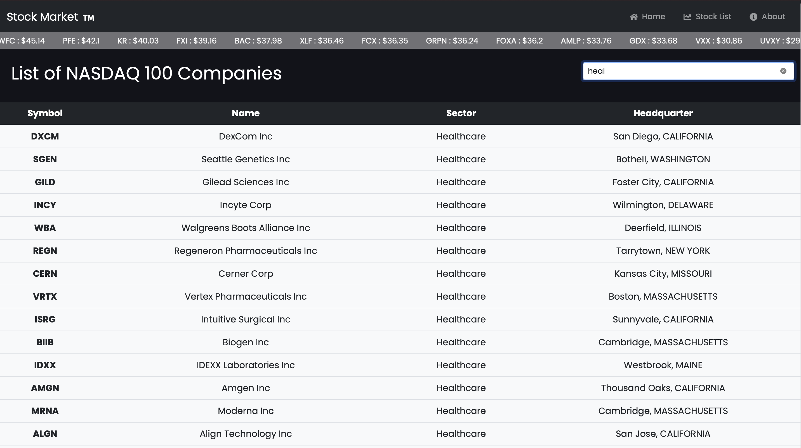
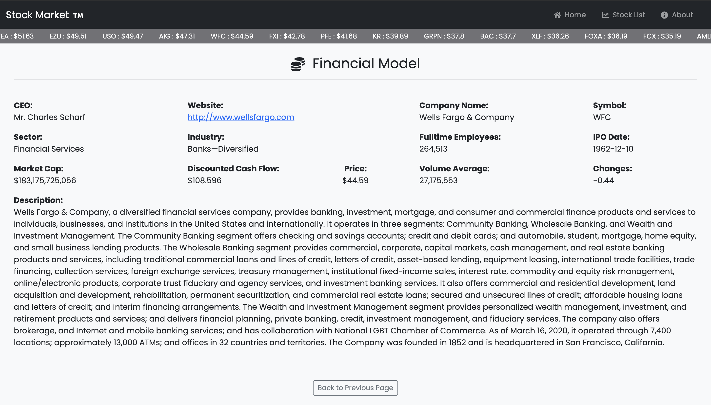

# Stock Market App

## Live Link
[Get up-to-date stock news and prices on the Stock Market](https://app-stock-market.herokuapp.com/)
## Objectives
- Handling lifecycle methods and resuable logic with React Hooks
- Using client side routes with React Router
- Interacting with an API Backend
- Using Redux in a React application
- Structuring a Redux store
- Using React Redux Hooks
- Managing async workflows with Redux Sagas
- Calculating derived data with Redux Selectors
- Unit testing a React and Redux application
- Functional Programming
- Meeting model client requirements

## Features
Stock Market &trade; is a single page application built with React and Redux. It relies on data provided by the [Financial Modeling Prep API](https://financialmodelingprep.com/developer/docs/) to display up-to-date news and stock prices covering companies listed on, but not limited to, the `NYSE` and `NASDAQ`. The `Home` page provides top stories in the stock market and a catalogue of 100 trading companies, each with their ticker symbols, name and exchange. By default, the directory catalogues companies from `All Markets`. Two other categories, `New York Stock Exchange` and the `Nasdaq Global Select` can be toggled to view companies listed. Users can click on the company's name to view its financial model. The search field above can be used to look up companies by `trading symbol`. The `Stock List` page contains a list of all `NASDAQ 100` constituents. Companies can be filtered by `sector` or `symbol` using the search field. Clicking on a row allows users to get more details for companies listed. These details are provided on the `Financial Model` page. The `About` page contains attribution to the API backend and developer of the Stock Market app. On all pages, the `Ticker` keeps users updated with stock prices. This application is deployed to Heroku.


_Filtering companies listed on the NASDAQ 100 by sector_



_Viewing a company's financial model_



## Prerequisites
- Internet Connection
- An Integrated Development Environment
- Chrome, Firefox or Safari across all screen sizes
- Node Package Manager [(NPM)](https://docs.npmjs.com/about-npm)

## Built With
- Node.js
- React
- React Router v6
- Redux
- Redux Saga
- Javascript ES6+
- npm packages
- Bootstrap 5
- SCSS
- HTML5/CSS3


## Getting Started
- To get started with the app, sign up on the [Financial Modeling Prep API](https://financialmodelingprep.com/developer/docs/) to get your API key.
- Clone this project by running `git clone https://github.com/george-swift/stock-market.git`
- Create a `.env` file in the root directory. Inside the `.env` file, save your API key in the format shown below:
```
REACT_APP_API_KEY=YOUR API KEY HERE
```
- Run `npm install` to install the needed packages and dependencies.
- After installing all dependencies, run `npm start` to fire up a local server with live reloading.
- If not already redirected, visit `http://localhost:3000/` in your browser to use the Stock Market app.
- To terminate the server, enter `Ctrl + C` in your terminal.
- To get a production bundle, run `npm run build`

## Testing
Run `npm test` to get a verbose test report.

### *Testing Tools*
- React Testing Library
- Jest Snapshot
- Enzyme

## Authors

👤 &nbsp; **Ubong George**
- LinkedIn: [Ubong George](https://www.linkedin.com/in/ubong-itok)
- Twitter: [@\_\_pragmaticdev](https://twitter.com/__pragmaticdev)
- GitHub: [@george-swift](https://github.com/george-swift)

## Acknowledgments

- [React](https://reactjs.org/)
- [Redux](https://redux.js.org/api/api-reference)
- [Financial Modeling Prep API](https://financialmodelingprep.com/developer/docs/)
- [Microverse](https://www.microverse.org/)

## Show your support

Leave a :star:️ &nbsp; if you like this project!

## License

Available as open source under the terms of the [MIT License](https://opensource.org/licenses/MIT).